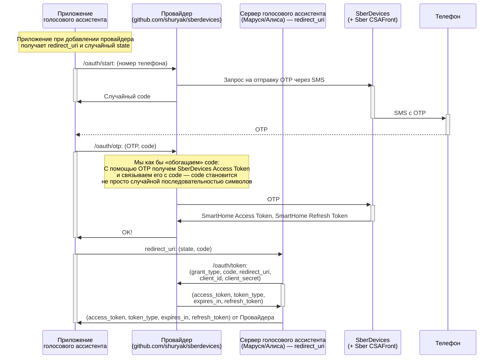

# Провайдер умного дома SberDevices <!-- omit in toc -->

> [!CAUTION]
>
> Данное приложение не несёт в себе цели навредить информационной безопасности
> сервисов Умного дома Sber, вся информация для разработки получена из открытых
> источников. Приложение опубликовано в открытый доступ исключительно в
> ознакомительных целях. Разработчик не несёт ответственности за любые возможные
> последствия использования приложения и его программного кода. Использование
> приложения и его программного кода осуществляется пользователями на свой страх
> и риск.
>
> Разработчик приложения призывает соблюдать все нормы и правила информационной
> безопасности и избегать любых действий, которые могут нарушить безопасность
> систем.

## Содержание <!-- omit in toc -->

- [Получение токена SmartHome](#получение-токена-smarthome)
  - [1. Запрос на отправку OTP в SMS](#1-запрос-на-отправку-otp-в-sms)
  - [2. Запрос на подтверждение OTP](#2-запрос-на-подтверждение-otp)
  - [3. Обмен `authcode` на CSAFront-токен](#3-обмен-authcode-на-csafront-токен)
  - [4. Получение SmartHome-токена по CSAFront-токену](#4-получение-smarthome-токена-по-csafront-токену)
- [Обновление CSAFront-токена](#обновление-csafront-токена)
- [Флоу авторизации при добавлении провайдера](#флоу-авторизации-при-добавлении-провайдера)

## Получение токена SmartHome

### 1. Запрос на отправку OTP в SMS

URL: `POST https://online.sberbank.ru/CSAFront/uapi/v2/authenticate`.

Обязательные HTTP-заголовки:

- `Referer`: `SD`.

Тело запроса:

```jsonc
{
  "authenticator": {
    "type": "sms_otp"
  },
  "identifier": {
    "data": {
      "value": "" // Номер телефона в формате 78001002030
    },
    "type": "phone"
  },
  "channel": {
    "data": {
      "os": "iOS",
      "rsa_data": {
        "deviceprint": "{}",
        "htmlinjection": "htmlinjection",
        "dom_elements": "dom_elements",
        "manvsmachinedetection": "manvsmachinedetection",
        "js_events": "js_events"
      },
      "browser": "SFVC",
      "oidc": {
        "code_challenge_method": "S256",
        "nonce": "", // случайная строка из 64 символов
        "scope": "openid",
        "redirect_uri": "homuzapp://host",
        "code_challenge": "", // см. ниже
        "state": "", // случайная строка из 64 символов
        "client_id": "6835fd63-22c8-4c20-bd4a-2bba906afe5f",
        "response_type": "code"
      }
    },
    "type": "web"
  }
}
```

> На этом этапе необходимо сгенерировать `code_verifier` — криптографически
> случайную строку длиной 43-128 символов `A-Z`, `a-z`, `0-9` и пунктуационных
> символов `-._~` и запомнить её для дальнейших запросов.
>
> `code_challenge` в этом запросе будет вычисляться как
> `base64url(sha256(code_verifier))`.
>
> Подробнее о `base64url` [здесь](https://base64.guru/standards/base64url).
>
> Такой механизм называется OAuth 2.0 PKCE Flow. Попробовать его на тестовом
> примере можно
> [здесь](https://www.oauth.com/playground/authorization-code-with-pkce.html).
> Дополнительно —
> [инструмент для генерации code_verifier и code_challenge](https://example-app.com/pkce).

Пример ответа:

```json
{
  "authenticator": [
    {
      "type": "sms_otp",
      "lifetime": 180,
      "data": {
        "phones": ["+7 (800) ***2030"]
      },
      "attempts_remaining": 3,
      "initialization_required": false
    }
  ],
  "ouid": "a73057d754e6d15b027c0ac26abacdc4d"
}
```

### 2. Запрос на подтверждение OTP

URL: `POST https://online.sberbank.ru/CSAFront/uapi/v2/verify`.

Обязательные HTTP-заголовки:

- `Referer`: `SD`.

Тело запроса:

```jsonc
{
  "authenticator": {
    "type": "sms_otp",
    "data": {
      "value": "" // полученный OTP в SMS
    }
  },
  "identifier": {
    "type": "ouid",
    "data": {
      "value": "" // значение ouid из ответа в предыдущем запросе
    }
  },
  "channel": {
    "data": {
      "rsa_data": {
        "htmlinjection": "htmlinjection",
        "dom_elements": "dom_elements",
        "manvsmachinedetection": "manvsmachinedetection",
        "deviceprint": "{}",
        "js_events": "js_events"
      }
    },
    "type": "web"
  }
}
```

Пример ответа:

```jsonc
{
  "response_data": {
    "redirect_uri": "homuzapp://host",
    "authcode": "5F0F7AD9-4763-296B-656D-301AA9A21143",
    "state": "DwS5UYnkcmiozklQUrEiTtxub1xiWKfj5e3HErsswkvz89miivN8XYHUrOx3YQu7" // state из 1-го запроса
  }
}
```

### 3. Обмен `authcode` на CSAFront-токен

URL: `POST https://online.sberbank.ru:4431/CSAFront/api/service/oidc/v3/token`.

Тело запроса `x-www-form-urlencoded`:

- `grant_type`: `authorization_code`
- `client_id`: `6835fd63-22c8-4c20-bd4a-2bba906afe5f`
- `code`: `authcode` из ответа предыдущего запроса
- `redirect_uri`: `homuzapp://host`
- `code_verifier`: сгенерированный на этапе 1-го запроса `code_verifier`.

Пример ответа:

```jsonc
{
  "access_token": "...", // CSAFront-токен
  "token_type": "Bearer",
  "expires_in": 2400,
  "id_token": "...",
  "refresh_token": "..." // refresh_token для получения новой пары токенов
}
```

`refresh_token` понадобится для
[обновления CSAFront-токена](#обновление-csafront-токена).

### 4. Получение SmartHome-токена по CSAFront-токену

URL: `GET https://mp-prom.salutehome.ru/v13/smarthome/token`.

Обязательные HTTP-заголовки:

- `Host`: `mp-prom.salutehome.ru`
- `Authorization`: `Bearer access_token_из_ответа_предыдущего_запроса`.

Пример ответа:

```jsonc
{
  "state": {
    "status": 200
  },
  "token": "..." // SmartHome-токен
}
```

## Обновление CSAFront-токена

URL: `POST https://online.sberbank.ru:4431/CSAFront/api/service/oidc/v3/token`.

Тело запроса `x-www-form-urlencoded`:

- `grant_type`: `refresh_token`
- `refresh_token`: `refresh_token_полученный_в_прошлый_раз`.

Пример ответа:

```jsonc
{
  "access_token": "...", // CSAFront-токен
  "token_type": "Bearer",
  "expires_in": 2400,
  "refresh_token": "..." // refresh_token для получения новой пары токенов
}
```

По обновлённому CSAFront-токену следует
[получить SmartHome-токен](#4-получение-smarthome-токена-по-csafront-токену).

## Флоу авторизации при добавлении провайдера


